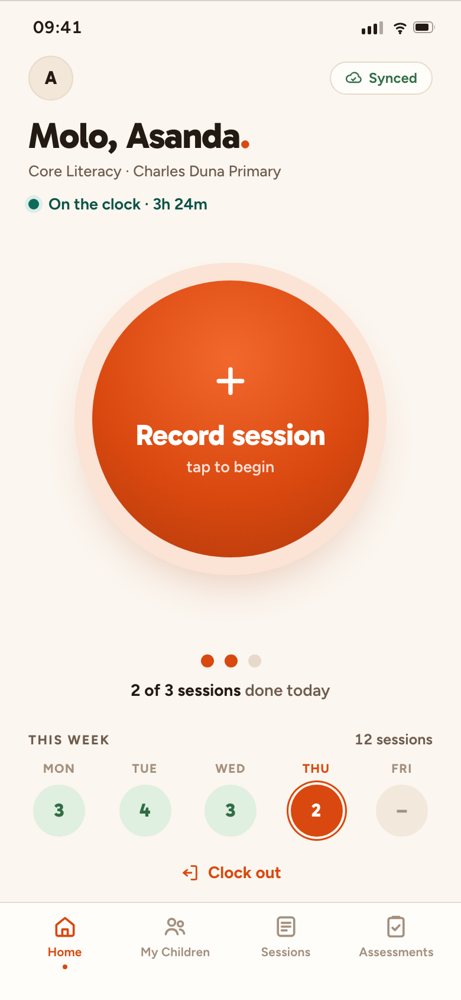
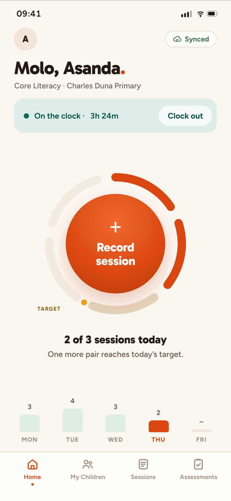
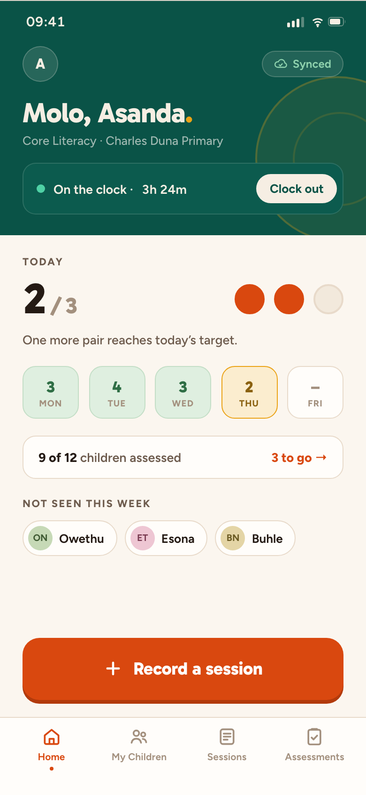
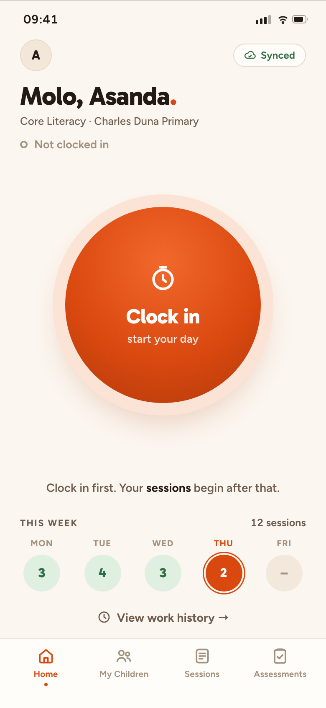
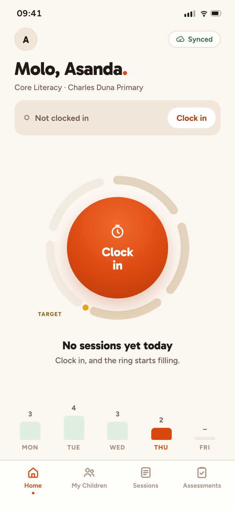
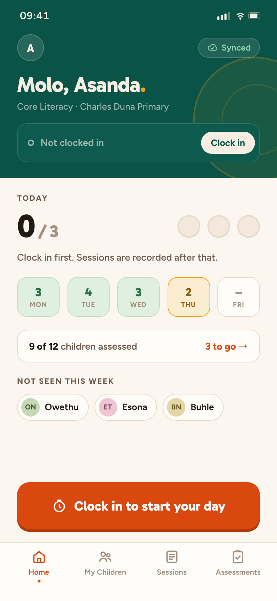
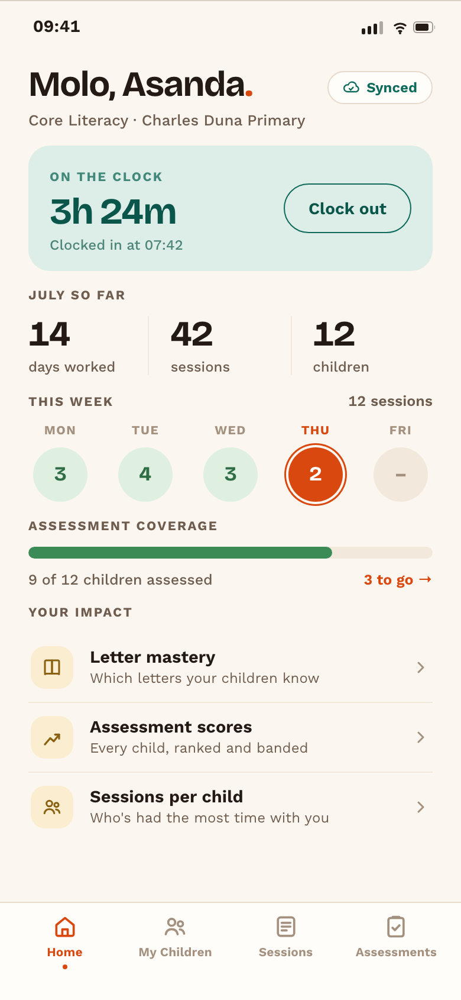
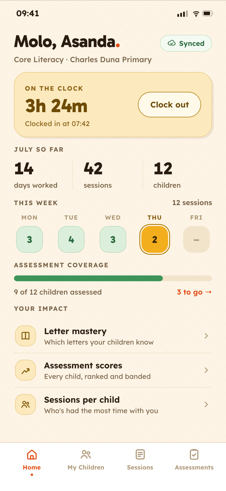
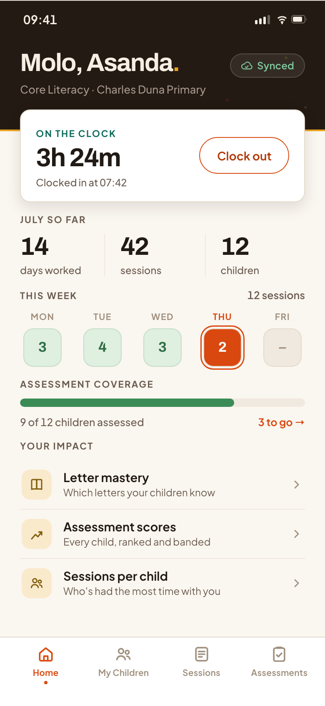

# Home simplification + de-bookified Ithemba, July 2026

Round two of the main-screen explorations. Round one lives in `../mockups-2026-07/`
and is unchanged. This round responds to two notes:

1. **"Direction A (Ithemba) by a long shot, then B. Definitely not C."**
2. **"Ithemba is a little too bookish for Masinyusane, but I like the hint of
   professionalism it brings."** Levers to pull: the serif, and the muted palette.

Plus a brief: a **simplified, CTA-led home page** in the spirit of the Zazi iZandi
screenshots (`../mockups-2026-07/zazi-izandi-screen-shots/`), without copying them.

Everything is static HTML at 390x844 with self-hosted fonts. Open any `index.html`
directly from disk. No server, no build step.

---

## The finding that shaped all of this

Before drawing anything I read the actual Home screen. Two things turned out to be true.

**Home is already a single stateful CTA wearing six cards as a disguise.**
`HomeScreen.js:211` already has a "Record Session" button, and
`useSessionLaunchGuard.js:30` already refuses it until you are clocked in. So the
real flow is:

```
not clocked in  ->  Clock In
clocked in      ->  Record a session
```

Zazi's one-big-button home is not a style choice. It is an honest rendering of a
state machine this app already runs. Simplifying Home is mostly *deletion*.

**The daily target exists, but it is drawn on the wrong screen.**
`sessionGoal.js:11` knows Core Literacy has a **target of 3 and a ceiling of 5**, yet
`SessionsTodayRing` only renders on the Sessions tab. Home today shows raw weekday
counts with **no goal reference at all**. All three home layouts below promote the
target to Home, which is where the EA actually decides what to do next.

So the simplification is not only visual. It is moving one component up a level and
deleting six cards that were competing with the one that matters.

---

## Part 1: Simplified Home (`01-home-explorations/`)

Three layouts, each in **both clock states**. Type and colour are held **constant**
across all three on purpose: this is a layout study, so type must not be a
confounding variable. Any of the A1/A2/A3 skins in Part 2 can wear any of these.

| | | |
|---|---|---|
|  |  |  |
| **H1 · Qala** ("begin") | **H2 · Day Arc** | **H3 · Ukusa** ("dawn") |
|  |  |  |

### H1 · Qala, the one button
Closest to Zazi. One unmissable circular target in a calm field, and everything that is
not the button whispers. The day's state is one line beneath it (three pips, "2 of 3
sessions done today"), the week is a quiet strip, and clock-out is a text link.

**For:** the least to look at, the most obvious thing to do. Very hard to get wrong.
**Against:** a centred circle sits in the middle of the screen, which on a 6" phone is
the *hardest* place for a thumb to reach. It is the prettiest and the least ergonomic.

### H2 · Day Arc, the ring is the button
The target ring wraps the CTA, so pressing the button visibly fills your day. The ring
is **five segments**: the first three are the target (darker track), the last two are
the bonus zone up to the ceiling of five, and the gold tick marks the target line.
Every number in it is data `sessionGoal.js` already holds.

**For:** the most information-dense idea here that still has exactly one CTA. It makes
the target legible without spending a card on it.
**Against:** the most novel, so the most likely to need explaining once. The five-segment
ring is a small thing to learn.

### H3 · Ukusa, band and slab
Identity and clock state go into a deep teal band with a sun rising behind it, and the
CTA is a full-width slab in the **thumb zone**. Between them: today's count, the week,
coverage, and **who you have not seen this week**, which `dashboardStats.js:354` already
computes but only shows on the Sessions tab. It is the one thing that tells an EA *who
to pull next*.

**For:** the only layout that answers "what do I do now?" rather than just "how am I
doing?". Best ergonomics of the three, because a slab is far kinder to a thumb than a
centred circle.
**Against:** the least "simple" of the three. It is a simplified home, not a minimal one.
The whitespace above the slab is a deliberate thumb gutter, not an unfinished layout.

**My pick: H3, with H1's restraint applied to it.** H1 is the most beautiful and H2 the
most clever, but H3 is the only one that helps an EA decide *what to do*, and its CTA is
where a thumb actually lands. If you want maximum simplicity instead, take H1 and move
the orb down.

---

## Part 2: Ithemba, de-bookified

Same four screens, same content, same numbers as direction A. **Only type and colour
change.** They are a controlled experiment: the markup lives in one shared file
(`shared/screens.js`) and each variant is a CSS skin, so the only thing you are judging
is the thing your designer flagged.

That also proves something useful. Each skin is expressible **purely as tokens**, which
is exactly what porting a winner into `src/constants/colors.js` would require.

### The palette, and why it is not just "warmer"

A warm palette turns to mush unless each colour has a job:

| Colour | Job |
|---|---|
| **Flame** `#D9480F` | Do something. Today. The only action colour. |
| **Teal** `#0E6B5C` | Status: working, on the clock, trustworthy. **This is where the "professionalism" now comes from, carried by colour instead of by a serif.** |
| **Gold** `#EBA317` | Attention, targets, timed things. |
| **Green** `#3B8B57` | Success, above benchmark. |
| **Crimson** `#9B2233` | The "needs work" score band. **Deliberately not the flame.** |

That last row is load-bearing. `documentation/design-system.md` already warns that brand
red and error red must never collide (the guard test asserts `colors.error !== colors.primary`),
and with an orange-red primary that trap is very easy to fall into. The score bands stay
green / amber / crimson, per `scoreBands.js` and ADR-0003.

### A1 · Ithemba Bold (`02-a1-ithemba-bold/`)


**Bricolage Grotesque + Work Sans.** The straight answer to the note: Ithemba with the
serif taken out. Same editorial bones, same warmth, but Bricolage is a characterful
*grotesque*, so it keeps the personality without the "well-made book" association. The
clock ribbon turns teal, because being on the clock is a **state**, not an action.

*Closest to what you already liked. Lowest risk.*

### A2 · Ithemba Sun (`03-a2-ithemba-sun/`)


**Gabarito + Lexend.** The warm end of the range: sunnier ground, chunkier forms, a
whisper of woven texture, a solid gold clock slab. Two craft decisions worth naming:

- **Shadows are hard offsets with zero blur.** Blurred shadows dissolve on cheap Android
  panels at low brightness. A crisp offset edge survives.
- **"Today" is gold with ink text, not flame with white.** Dark-on-yellow is the
  highest-contrast pairing available in direct sunlight, which is where this app is
  actually used. (Stolen, unrepentantly, from direction C.)

Lexend was designed specifically to improve reading proficiency. For a literacy NPO that
is a real resonance, not a cute one.

*The most joyful, and the most legible outdoors. Furthest from "bookish".*

### A3 · Ithemba Ink (`04-a3-ithemba-ink/`)


**Archivo + Plus Jakarta Sans.** The version a funder can look at without translation.
A deep espresso band tops every screen with a gold rule, and the first card lifts onto
its edge. Tighter type, squarer corners, reads as a record.

Two things to know. It reuses a structure the codebase **already has tokens for**
(`heroDark` / `onDark` / `onDarkMuted`), so it is the cheapest of the three to adopt.
And it is **deliberately not a dark theme**: the body stays bone, because field staff
work outdoors and a dark UI is exactly wrong in direct sun. The dark band is a header,
not a mode.

*The most professional. Warm, but serious.*

---

## If you adopt any of this

These mockups **propose a new palette**, so adopting one is a **rebrand, not a re-skin**.
Concretely it means changing `src/constants/colors.js` *and* `__tests__/colors.test.js`,
which is fail-closed on the exact token key set and value list, by design, so this cannot
happen by accident. None of it is hard. It just should be a decision rather than a drift.

Note also that the current brand red (`primary = #E72D4D`) does not appear anywhere here.
Neither did direction A's clay. That question was open before this round.

---

## Files

```
fonts/                  self-hosted latin-subset woff2 (all OFL, all Google Fonts)
shared/chrome.css       phone frame, status bar, tab bar. All token-driven.
shared/chrome.js        injects status bar + tab bar into every .phone
shared/screens.js       the four screens as ONE source of truth (A1/A2/A3 share it)
shared/screens.css      structure for those screens. Every value is a CSS variable.
shot.mjs                renders every .phone to PNG at 2x
```

Fonts are self-hosted rather than linked, so the mockups render identically offline, in
CI, and in a headless screenshot run with no network.

**To regenerate the PNGs.** Playwright is deliberately *not* a project dependency: a
nested `node_modules` in this folder would confuse Metro and Jest.

```bash
cd /tmp && mkdir -p mockshot && cd mockshot && npm i playwright && npx playwright install chromium
ln -s /tmp/mockshot/node_modules <this-folder>/node_modules
cd <this-folder> && node shot.mjs && rm node_modules
```

`shot.mjs` also **measures overflow**. A phone is a hard-clipped 844px box, so content
that overruns is silently guillotined and then looks like a design choice in a PNG. It
prints `CLIPPED` per screen instead of letting you find out later. It caught four real
clipping bugs during this build.
