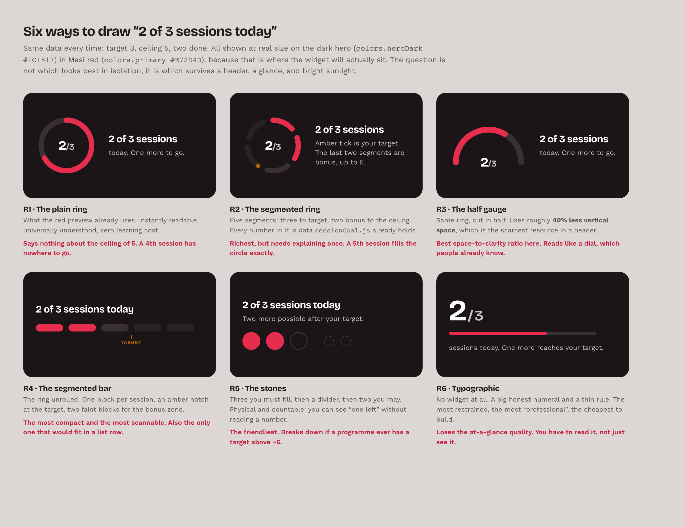
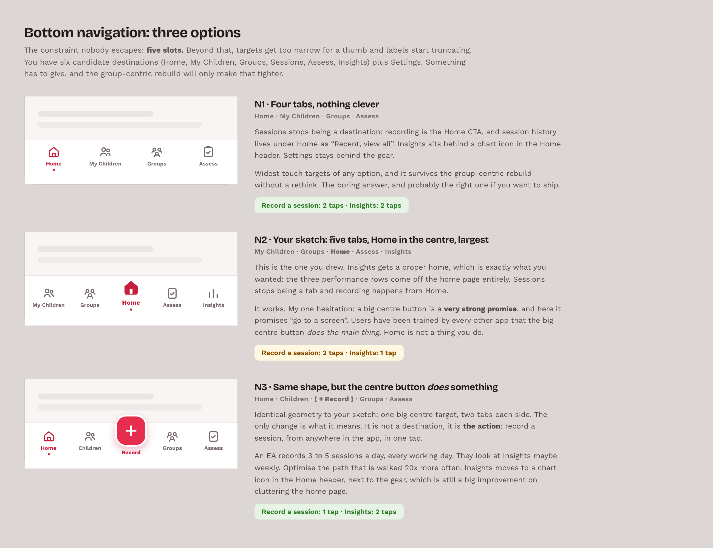
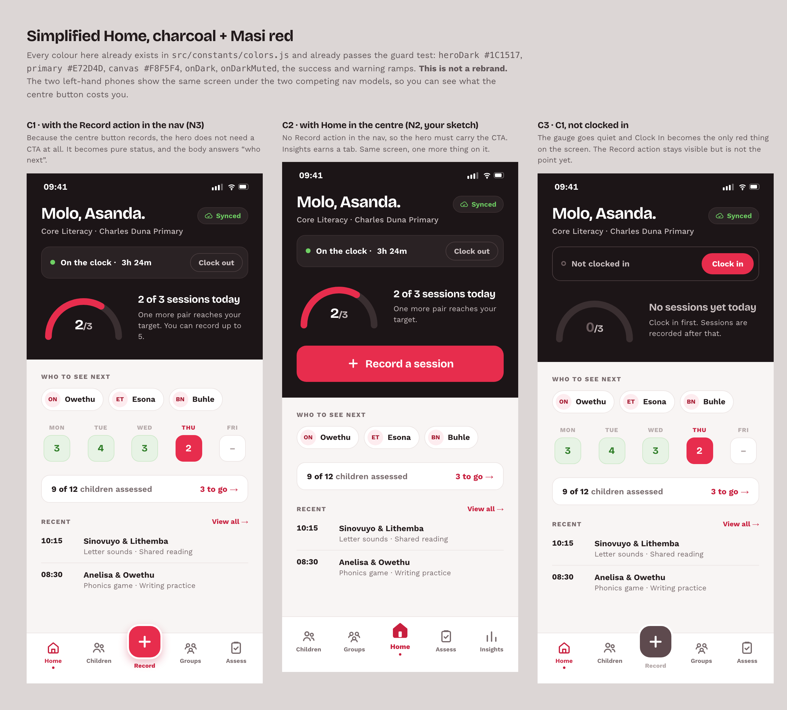

# Round three: charcoal + Masi red, and three open questions

Round two (`../mockups-2026-07-b/`) proposed new warm palettes. This round drops them,
for one reason that turned out to be decisive.

## Charcoal + Masi red is not a rebrand. It is what the app already ships.

Open `src/constants/colors.js`:

```js
heroDark:    '#1C1517'   // charcoal
primary:     '#E72D4D'   // Masi red
text:        '#221A1B'
background:  '#F8F5F4'
onDark:      '#FFFFFF'
onDarkMuted: '#C9BFC0'
ringNeutral: '#9AA3AB'   // zero importers. Waiting for exactly this ring work.
ringStart:   '#8A939C'   // zero importers.
```

That is precisely the palette we want, it already passes the fail-closed guard test in
`__tests__/colors.test.js`, and two of its tokens were defined for a session ring that
was never built. So the real choice is not "warm vs. brand". It is:

- **My round-two palettes:** a token migration, a guard-test rewrite, and a brand decision.
- **Charcoal + red:** zero palette cost. Spend the whole budget on layout.

Everything in this folder uses the second. `brand.css` copies the tokens verbatim, with
the source line noted against each one.

---

## 1. Alternatives to the ring (`01-progress-options/`)



Six ways to draw "2 of 3 sessions today", all at real size, all on `heroDark`, because a
progress widget that reads beautifully on white and dies on charcoal is not a candidate.

**R3, the half gauge, is my pick.** It keeps everything people already understand about a
ring, and costs about 40% less vertical height. Height is the scarcest resource in a
header, and a header is where this belongs.

**R4, the segmented bar, is the sleeper.** It is the only one of the six that would fit
inside a list row, which matters a lot once the group-centric rebuild lands and you want
per-group progress.

## 2. Bottom navigation (`02-bottom-nav/`)



Five slots is the hard ceiling. There are six candidate destinations (Home, My Children,
Groups, Sessions, Assess, Insights) plus Settings, so something must give, and the
group-centric rebuild only tightens this.

The honest trade, drawn three ways:

| | Record a session | Insights |
|---|---|---|
| **N1** four tabs | 2 taps | 2 taps |
| **N2** Home in the centre (your sketch) | 2 taps | **1 tap** |
| **N3** centre button records | **1 tap** | 2 taps |

**N3 is the disagreement.** Your sketch's geometry is right (one big centre target, two
tabs each side). My argument is only about what it *means*. Every other app has trained
people that the big centre button **does the main thing**, and Home is not a thing you do.
An EA records 3 to 5 sessions a day and looks at Insights maybe weekly. Optimise the path
walked twenty times more often.

Either way, the performance rows come off the home page, which is what you asked for.

## 3. The simplified home (`03-red-charcoal-home/`)



Three phones: the same screen under N3, under N2, and the not-clocked-in state.

Four things fixed vs. `documentation/design/item3-red-palette-preview.html`:

1. **Quick Actions deleted.** Two of its four buttons (Children, Assess) were a second
   door to a bottom tab. "Sync" is a status, not an action. Only Clock In was real, and it
   is now a proper row in the hero.
2. **The count is said once.** The ring said 2/3 and the card below said "2 Sessions". The
   card is gone.
3. **Real line icons, not system emoji.** Emoji render differently on every Android and
   quietly undo the professionalism you like.
4. **No red glow behind the CTA.** It colour-bands on cheap panels.

The space that bought is spent on the question the screen was not answering:
**who do I see next.** `dashboardStats.js:354` already computes `notSeenThisWeek` and today
it only appears on the Sessions tab.

---

## Still open

- **Group-centric rebuild.** Not built yet, and it changes this. The mockups assume a
  `Groups` tab already exists so the nav does not need re-deciding twice, but "who to see
  next" probably becomes "which group next", and R4's segmented bar becomes more attractive
  for per-group rows.
- **Where Sessions goes.** In every option here, Sessions stops being a tab: recording is
  the primary action, and the history lives under Home as "Recent, view all". That is a
  real decision and it should be a deliberate one.
