# Main screen redesign explorations, July 2026

Three distinct redesign directions for the four main bottom-tab screens (Home, My Children, Sessions, Assessments). Each direction is a static HTML mockup at 390x844 with self-hosted fonts, screenshotted at 2x. All content reflects the app's real features and data model: clock in/out with GPS, monthly and weekly session stats, the Sessions Today ring/target (target 3, ceiling 5 for Core Literacy R-3), pair-based groups, assessment coverage, EGRA Letter Sounds and Word Reading batteries, score bands on raw letters-per-minute, and visible sync state for offline-first field use.

Shared fictional data: EA Asanda Mnyanda, Core Literacy (Grade R-3) at Charles Duna Primary, 12 children in 6 pairs across Grade 1A and 1B. Child names are Xhosa names apt for Gqeberha.

How to view: open each direction's `index.html` in a browser (all four screens side by side), or look at the PNGs.

To regenerate screenshots: any headless Chromium via Playwright, viewport 1700x950, deviceScaleFactor 2, screenshot each `.phone` element.

Fonts are latin-subset woff2 files self-hosted in `fonts/` (all from Google Fonts, all OFL licensed), so the mockups render offline and inside CI.

---

## Direction A: Ithemba (warm, human-centred)

Folder: `direction-a-ithemba/`

| Home | My Children | Sessions | Assessments |
|---|---|---|---|
| 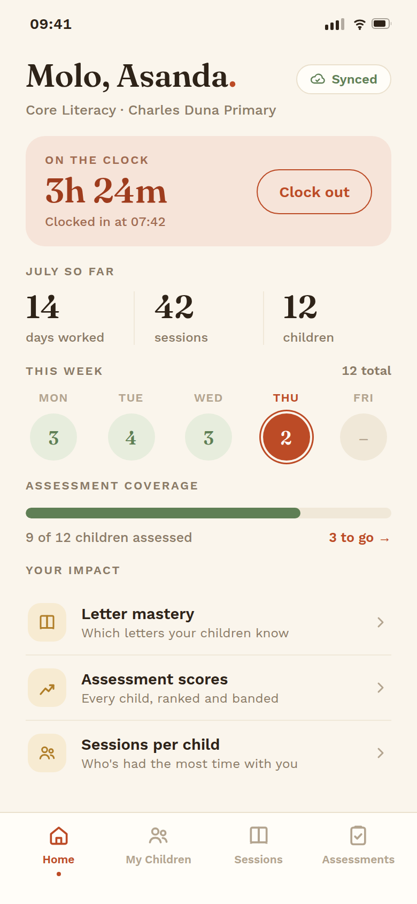 | 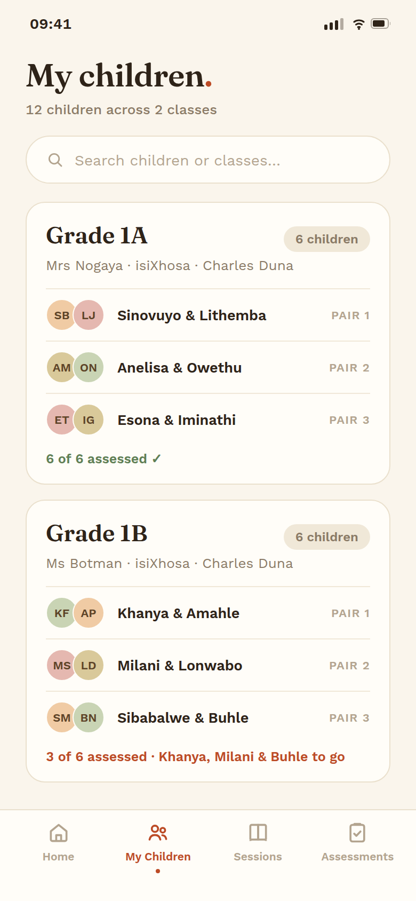 | 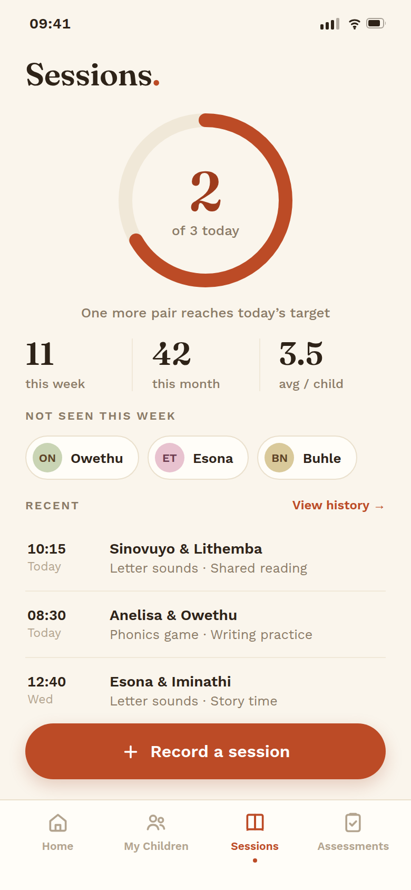 | 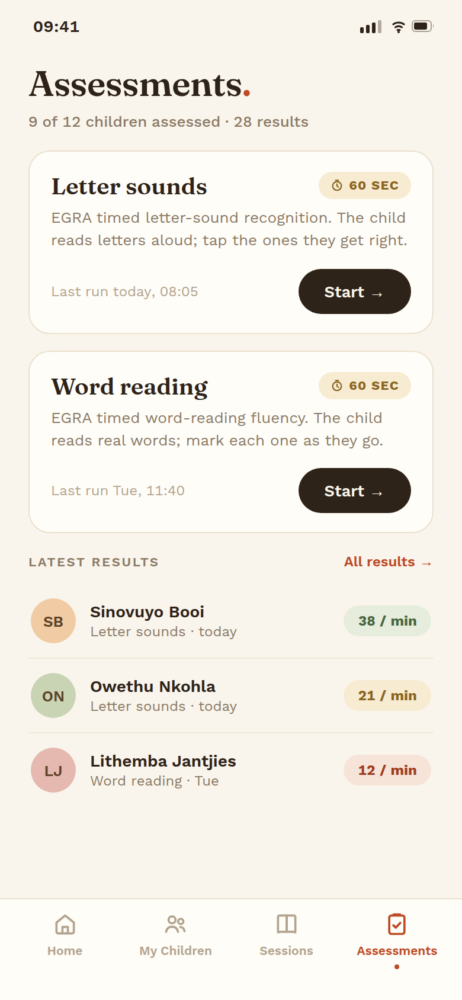 |

**Point of view.** The app is about children and the EA's relationship with them, so the UI should feel like a warm, well-made book rather than an admin tool. "Ithemba" is isiXhosa for hope.

**Type.** Fraunces (a warm, characterful display serif) for greetings, numerals and card titles, paired with Work Sans for UI text. The serif numerals give stats a human, almost letterpress feel.

**Color.** Warm paper (`#FAF5EC`) instead of grey, espresso ink, and one confident accent: clay (`#BC4B26`), with sage green reserved for success and a soft sun tint for gentle callouts. No drop shadows anywhere; hierarchy comes from hairline borders, tinted panels and type scale.

**Layout logic.** Editorial rhythm: a big serif greeting ("Molo, Asanda."), quiet uppercase section labels, list rows instead of icon-grid cards. Pairs are first-class on My Children (the real unit of Core Literacy work), with warm-toned initial avatars. The clock panel is a tinted ribbon, not a card fighting ten other cards.

**What it fixes vs the current UI.** Replaces the blue-to-red gradient header, default Material cards and uniform white-card-on-grey with a single cohesive material. Celebrates the EA's impact (the "Your impact" list reframes the ranking screens) instead of presenting everything as equal-weight widgets.

---

## Direction B: Instrument (crisp professional field tool)

Folder: `direction-b-instrument/`

| Home | My Children | Sessions | Assessments |
|---|---|---|---|
| 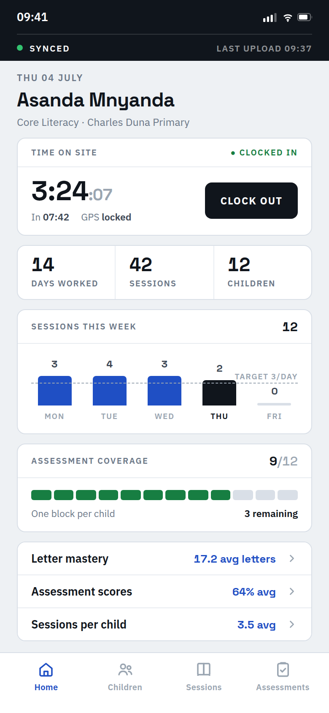 | 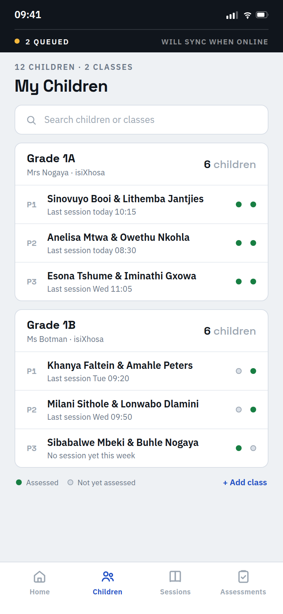 | 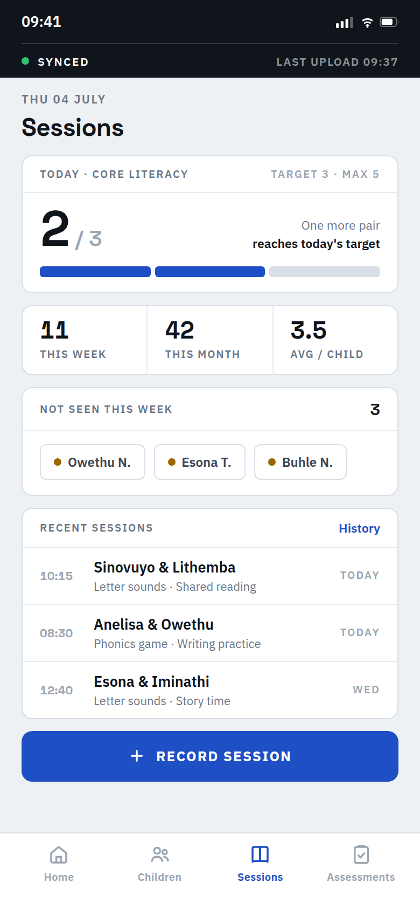 | 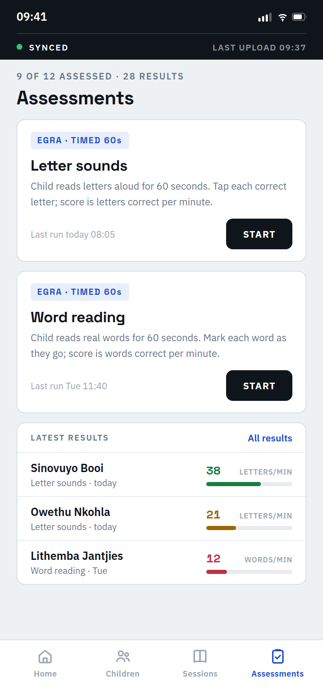 |

**Point of view.** The app is a precision instrument the EA trusts with their work record. Dense but calm information design, engineered for glanceability in bright sunlight.

**Type.** Space Grotesk for display and all numerals (tabular, with its distinctive flat-top 1), IBM Plex Sans for labels and body. Uppercase micro-labels with wide tracking give every module a labeled-gauge feel.

**Color.** Near-black ink on cool white modules over a pale grey field. One working blue (`#1F4FC4`) for actions and links. Green, amber and red appear only as semantic score bands, never as decoration.

**Layout logic.** Everything is a bordered module with a header row, like panels on a device. The dark system strip at the top turns sync state into a permanent instrument readout ("SYNCED, last upload 09:37" or "2 QUEUED, will sync when online"), which is honest about the offline-first reality. Real data visualization: a week bar chart with a dashed target line, per-child segmented coverage blocks, per-result score bars scaled against the 60-item EGRA grid, and per-child assessed dots on the pair table.

**What it fixes vs the current UI.** The current screens show stats as plain numbers in cards; this direction makes the numbers legible as data (targets, distributions, per-child state) and gives sync status a permanent, trustworthy home instead of an intermittent banner.

---

## Direction C: Khanya (bold, joyful, color-blocked)

Folder: `direction-c-khanya/`

| Home | My Children | Sessions | Assessments |
|---|---|---|---|
| 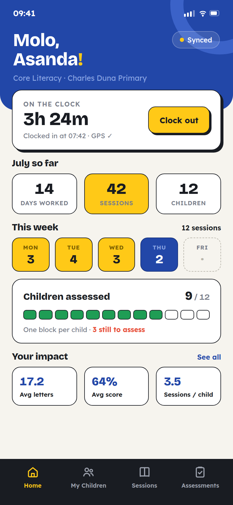 | 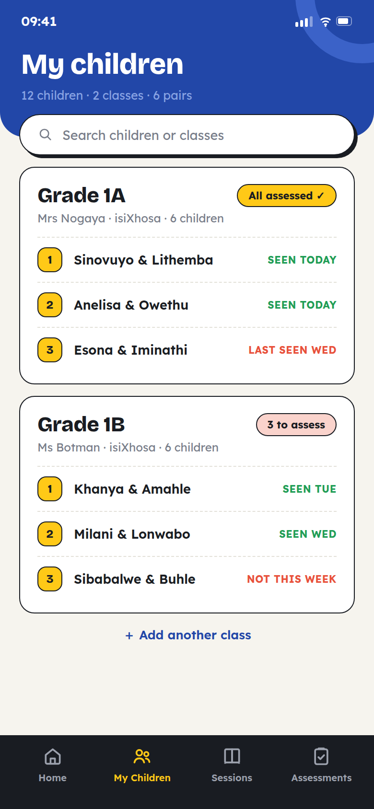 | 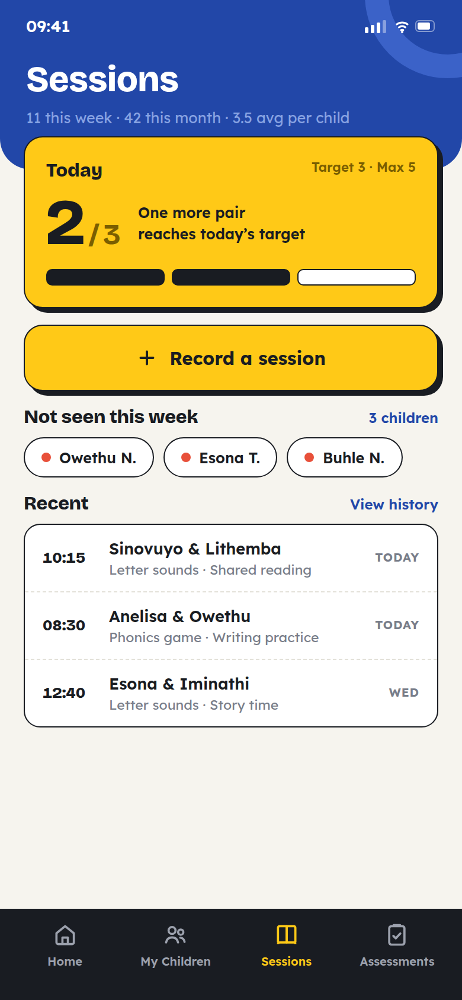 | 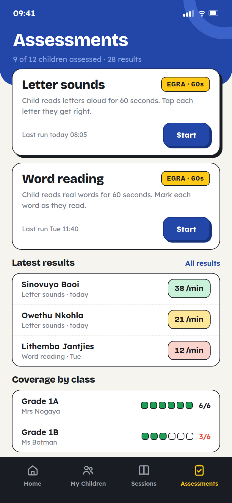 |

**Point of view.** Masi's brand colors used at full confidence. "Khanya" is isiXhosa for light or shine. Big type, flat color blocks and chunky outlined cards that read instantly on a mid-range Android screen outdoors, and feel joyful in a way that suits work with young children without being childish.

**Type.** Bricolage Grotesque (a characterful display grotesque) for headings and numerals, paired with Lexend for UI text. Lexend was specifically designed to improve reading proficiency, a nice resonance for a literacy nonprofit.

**Color.** Deep Masi blue hero blocks with a big ring motif, brand yellow (`#FFC917`) as the single action color (every primary button is yellow with ink text, the highest-contrast combination in sunlight), warm off-white ground, coral and green for semantic states only.

**Layout logic.** Each screen opens with a full-bleed blue block that holds the title and one key line, with the first card overlapping the block's bottom edge. Cards are white with 1.5px ink outlines and hard offset shadows: no blur, so edges stay crisp at low brightness and cheap screens. The week is a row of stamped day blocks; coverage is one outlined block per child.

**What it fixes vs the current UI.** The current app whispers its brand (one gradient header). This direction makes the brand the interface, gives EAs unmissable touch targets, and keeps every screen to one dominant color plus one accent per the existing brand rule.

---

## Recommendation

All three are production-plausible. If forced to pick one: **Direction B (Instrument)** is the strongest foundation for the app Masi is actually becoming (a data-capture and assessment tool whose numbers HQ relies on), and its module system scales cleanly to the WelaPLUS battery screens. Direction A's warmth and Direction C's yellow-button sunlight legibility are both worth stealing regardless of the chosen base.
