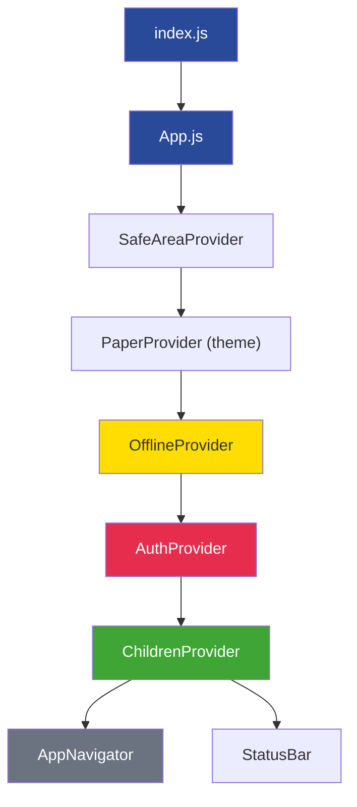
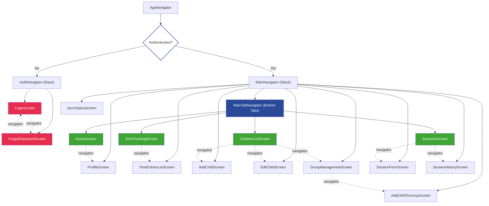
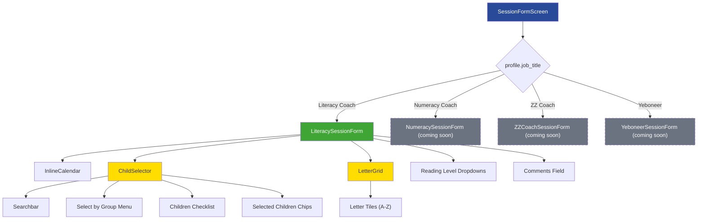
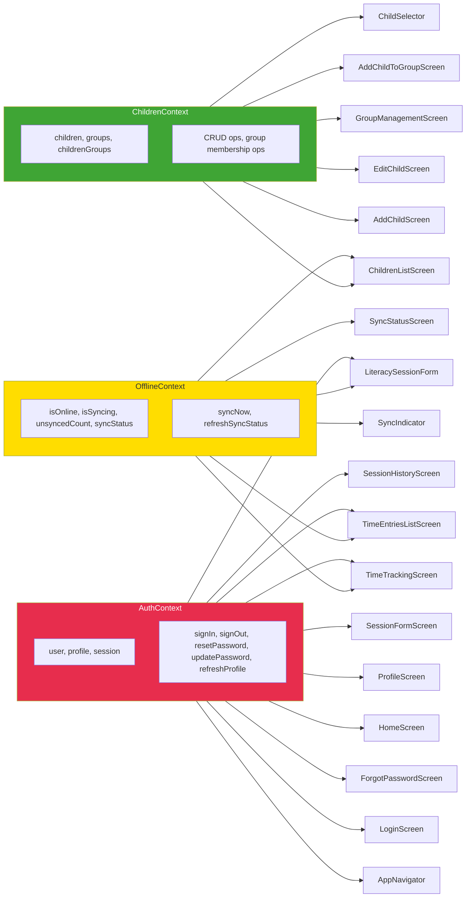
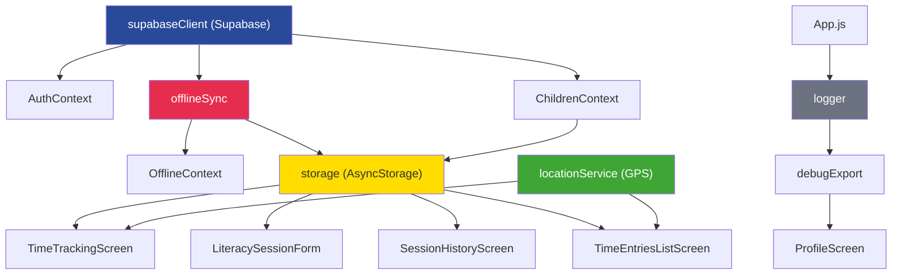
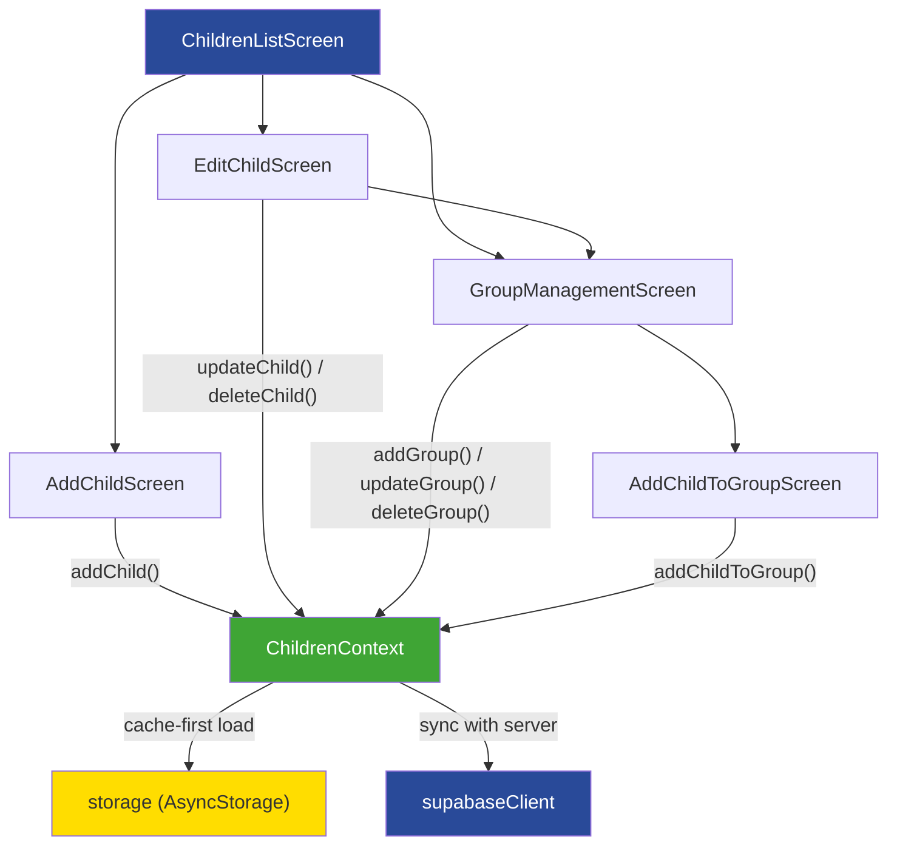
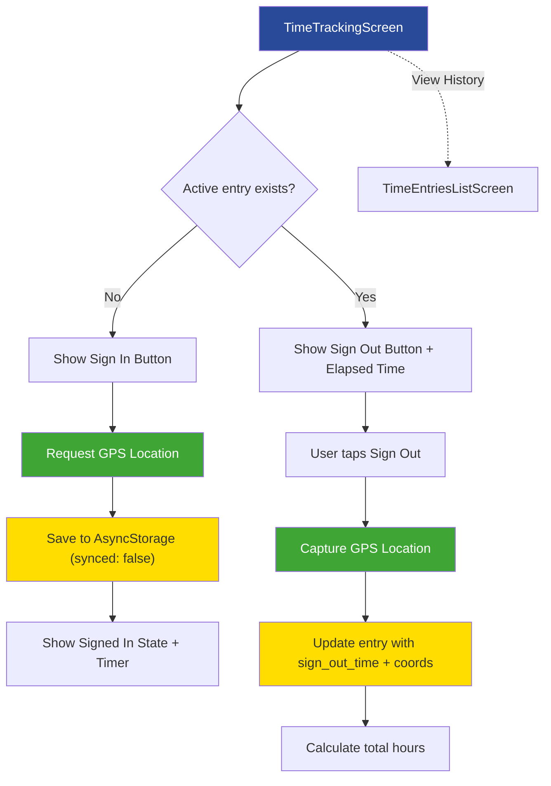
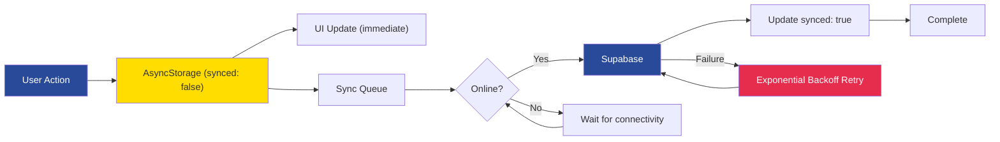

# Masi App - Component Tree (Mermaid Diagrams)

Visual component relationship diagrams using [Mermaid](https://mermaid.js.org/) syntax. Render these in any Markdown previewer that supports Mermaid (GitHub, VS Code with extension, etc.).

---

## 1. Provider Wrapping Hierarchy

---

## 2. Full Navigation Tree

---

## 3. Session Form Routing (Job-Title Based)

---

## 4. Context Provider → Consumer Relationships

---

## 5. Services & Data Flow

---

## 6. Children Management Flow

---

## 7. Time Tracking Flow

---

## 8. Offline Sync Pipeline

---

## 9. File Structure Overview

```mermaid
graph TD
    ROOT["masi-app/"] --> SRC["src/"]
    ROOT --> APP["App.js"]
    ROOT --> INDEX["index.js"]

    SRC --> NAV["navigation/"]
    SRC --> SCREENS["screens/"]
    SRC --> COMP["components/"]
    SRC --> CTX["context/"]
    SRC --> SVC["services/"]
    SRC --> UTIL["utils/"]
    SRC --> CONST["constants/"]

    NAV --> APP_NAV["AppNavigator.js"]

    SCREENS --> AUTH_DIR["auth/"]
    SCREENS --> MAIN_DIR["main/"]
    SCREENS --> CHILD_DIR["children/"]
    SCREENS --> SESS_DIR["sessions/"]

    AUTH_DIR --> LOGIN_F["LoginScreen.js"]
    AUTH_DIR --> FORGOT_F["ForgotPasswordScreen.js"]

    MAIN_DIR --> HOME_F["HomeScreen.js"]
    MAIN_DIR --> TIME_F["TimeTrackingScreen.js"]
    MAIN_DIR --> CHILDREN_F["ChildrenListScreen.js"]
    MAIN_DIR --> SESSIONS_F["SessionsScreen.js"]
    MAIN_DIR --> PROFILE_F["ProfileScreen.js"]
    MAIN_DIR --> TIME_LIST_F["TimeEntriesListScreen.js"]
    MAIN_DIR --> SYNC_F["SyncStatusScreen.js"]

    CHILD_DIR --> ADD_F["AddChildScreen.js"]
    CHILD_DIR --> EDIT_F["EditChildScreen.js"]
    CHILD_DIR --> GROUP_F["GroupManagementScreen.js"]
    CHILD_DIR --> ADD_GRP_F["AddChildToGroupScreen.js"]

    SESS_DIR --> FORM_F["SessionFormScreen.js"]
    SESS_DIR --> LIT_F["LiteracySessionForm.js"]
    SESS_DIR --> HIST_F["SessionHistoryScreen.js"]

    COMP --> COMMON_DIR["common/"]
    COMP --> CHILD_COMP["children/"]
    COMP --> SESS_COMP["session/"]

    COMMON_DIR --> SYNC_IND["SyncIndicator.js"]
    CHILD_COMP --> CHILD_SEL["ChildSelector.js"]
    SESS_COMP --> LETTER_G["LetterGrid.js"]

    CTX --> AUTH_CTX_F["AuthContext.js"]
    CTX --> OFFLINE_CTX_F["OfflineContext.js"]
    CTX --> CHILDREN_CTX_F["ChildrenContext.js"]

    SVC --> SUPA_F["supabaseClient.js"]
    SVC --> LOC_F["locationService.js"]
    SVC --> OFFLINE_F["offlineSync.js"]

    UTIL --> STORAGE_F["storage.js"]
    UTIL --> LOGGER_F["logger.js"]
    UTIL --> DEBUG_F["debugExport.js"]

    CONST --> COLORS_F["colors.js"]
    CONST --> JOBS_F["jobTitles.js"]
    CONST --> LIT_CONST_F["literacyConstants.js"]

    style ROOT fill:#294A99,color:#fff
    style SRC fill:#294A99,color:#fff
    style SCREENS fill:#3FA535,color:#fff
    style COMP fill:#FFDD00,color:#333
    style CTX fill:#E72D4D,color:#fff
    style SVC fill:#6B7280,color:#fff
    style UTIL fill:#6B7280,color:#fff
    style CONST fill:#6B7280,color:#fff
```

