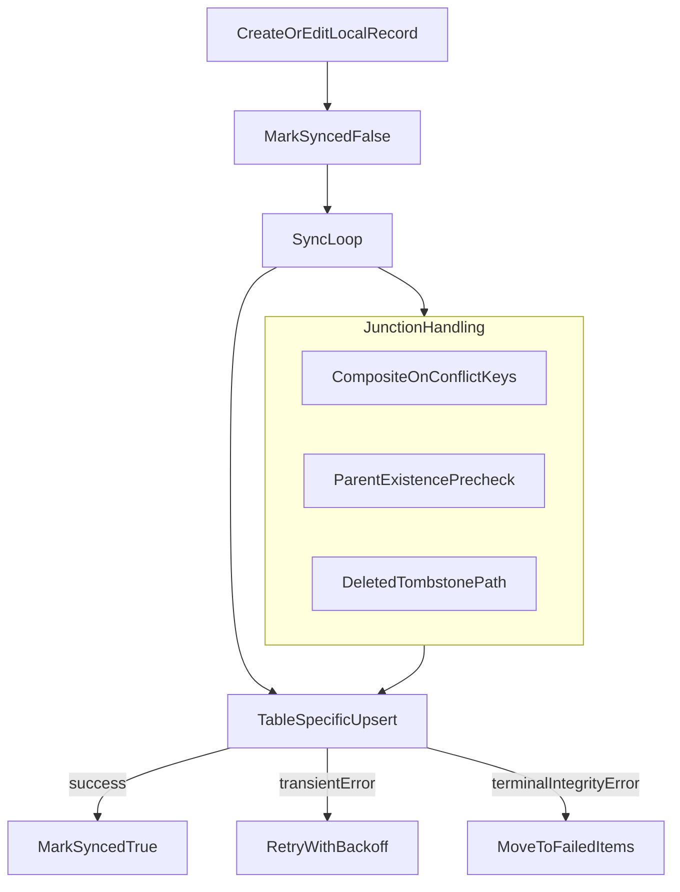

# Sync Error Root Fix Plan

## Confirmed Error Diagnosis

- **Transient network errors** (`TypeError: Network request failed`) occurred early, then recovered; evidence: later successful syncs for `TIME_ENTRIES`, `ASSESSMENTS`, `LETTER_MASTERY`, and `SESSIONS`.
- **Persistent FK failures (`23503`)** on `staff_children.child_id` and `children_groups.child_id` indicate junction rows reference a `child_id` that does not exist in server `children`.
- **Persistent unique failures (`23505`)** on `children_groups (child_id, group_id)` indicate local unsynced rows are trying to insert memberships that already exist server-side.
- **Impact pattern**: exactly 5 records keep cycling through retries for hours, creating a poisoned queue and repeated failed sync attempts.

## Root-Cause Hypothesis (Code-Backed)

- Current sync uses generic upsert conflict target `id` for all tables in [`/Users/jimmckeown/Development/masi-app/src/services/offlineSync.js`](/Users/jimmckeown/Development/masi-app/src/services/offlineSync.js), which is not idempotent enough for junction rows that are logically unique by composite keys.
- Group membership deletion and child deletion paths in [`/Users/jimmckeown/Development/masi-app/src/context/ChildrenContext.js`](/Users/jimmckeown/Development/masi-app/src/context/ChildrenContext.js) remove local records immediately (no sync tombstone), enabling:
  - orphaned local junction rows after child removal,
  - duplicate re-inserts when a server membership still exists.
- Retry loop in [`/Users/jimmckeown/Development/masi-app/src/services/offlineSync.js`](/Users/jimmckeown/Development/masi-app/src/services/offlineSync.js) treats FK/unique constraint errors as retriable, so terminal data-integrity errors keep reappearing.

## Implementation Plan

1. **Make junction sync idempotent**
   - In [`/Users/jimmckeown/Development/masi-app/src/services/offlineSync.js`](/Users/jimmckeown/Development/masi-app/src/services/offlineSync.js), set:
     - `STAFF_CHILDREN.onConflict = 'staff_id,child_id'`
     - `CHILDREN_GROUPS.onConflict = 'child_id,group_id'`
   - Keep upsert behavior, but resolve logical duplicates on composite keys rather than random UUID `id` only.
2. **Add terminal-error handling in sync loop**
   - In [`/Users/jimmckeown/Development/masi-app/src/services/offlineSync.js`](/Users/jimmckeown/Development/masi-app/src/services/offlineSync.js), detect non-retriable DB codes/messages (`23503`, `23505`) for junction tables.
   - Move these directly to failed/manual-review state without exponential backoff loops.
3. **Fix local referential integrity and deletion semantics**
   - In [`/Users/jimmckeown/Development/masi-app/src/context/ChildrenContext.js`](/Users/jimmckeown/Development/masi-app/src/context/ChildrenContext.js) + [`/Users/jimmckeown/Development/masi-app/src/utils/storage.js`](/Users/jimmckeown/Development/masi-app/src/utils/storage.js):
     - Cascade local cleanup when deleting a child (remove/mark related `staff_children` and `children_groups` rows).
     - Convert group-membership removal to tombstone-based sync deletion (`_deleted`) instead of hard local removal.
4. **Add lightweight orphan guard before junction sync**
   - In [`/Users/jimmckeown/Development/masi-app/src/services/offlineSync.js`](/Users/jimmckeown/Development/masi-app/src/services/offlineSync.js), pre-check parent existence (local + optionally server) for junction rows; quarantine/drop local orphan writes safely.
5. **Add regression tests for these failure classes**
   - Add/extend tests around:
     - duplicate membership re-sync after network failure,
     - child delete before sync completion,
     - junction row with missing parent child,
     - retry behavior for terminal vs transient errors.

## Rollout Safety (Backward-Compatible)

- No destructive schema changes required.
- App-side behavior changes are backward-compatible with currently deployed versions.
- Optional cleanup migration can be deferred and additive only if needed.

## Data-Flow Target State

